<div align="center">

<!-- ANIMATED WAVE HEADER -->


<!-- TYPING ANIMATION -->
<a href="https://git.io/typing-svg">
  
</a>

<br/>

<p>
  <a href="https://www.linkedin.com/in/jai-raj-choudhary-a6843a171/">
    
  </a>
  &nbsp;
  
  &nbsp;
  
  &nbsp;
  
</p>

<p>
  
  &nbsp;
  
  &nbsp;
  
  &nbsp;
  
</p>

</div>

---

<div align="center">

## 📰 As Featured In

<a href="https://timesofindia.indiatimes.com/etimes/trending/meet-jai-raj-choudhary-indian-origin-techie-who-says-working-in-ai-startup-9-to-9-six-days-a-week-changed-his-life/amp_articleshow/128782911.cms">
  
</a>
&nbsp;
<a href="https://www.aol.com/articles/pivoted-software-engineering-ai-taking-101001702.html">
  
</a>

<br/>
</div>

---

## `> whoami`

```python
class AIEngineer:
    def __init__(self):
        self.name        = "Jai Raj Choudhary"
        self.role        = "AI Engineer II @ StackAI (Y Combinator)"
        self.location    = "San Francisco, CA"
        self.education   = ["M.S. AI — Illinois Institute of Technology",
                            "B.Tech CS — UPES Dehradun"]
        self.experience  = "3+ years"
        self.stack       = ["RAG Pipelines", "LLMs", "Vector DBs",
                            "Temporal", "Kafka", "Kubernetes", "AWS"]
        self.philosophy  = "Ship fast. Learn faster. Obsess over the problem."

    def say_hi(self):
        print("Thanks for stopping by — let's build something intelligent.")

me = AIEngineer()
me.say_hi()
```

---

## `> story.md`

I made a bet on AI early — pivoting from software engineering to ML when the path wasn't obvious.

The **best decision I made** was joining **StackAI** for a role I didn't quite have all the experience for yet. I learned by building real systems, in production, for real clients — at a pace that forces you to grow.

In San Francisco, the culture hits differently. Every coffee shop has two founders at the table next to you. The people around you are solving hard problems, and that energy is contagious. It's **9-to-9, six days a week** — and I wouldn't trade it.

I specialize in **NLP pipelines**, **LLM systems**, and **document intelligence** — turning unstructured data into decisions that drive real revenue. My work at **Lineal Services, LLC** led to substantial revenue growth through intelligent document processing and real-time ML data frameworks.

> 🎓 &nbsp; M.S. AI · Illinois Institute of Technology &nbsp;|&nbsp; 📍 San Francisco, CA

---

## `> ./architecture`

**RAG Pipeline — Production**

```mermaid
flowchart LR
    A([User Query]) -->|embed| B[SQL Pre-filter\n+ Embedder]
    B -->|vector search| C[(HNSW Search\nWeaviate · Pinecone)]
    C -->|rerank| D[BM25 Reranker\n+ Context Builder]
    D -->|generate| E([LLM Response\nGPT-4 · Claude])

    style A fill:#161B22,stroke:#7B2FFF,stroke-width:2px,color:#E6EDF3
    style B fill:#161B22,stroke:#7B2FFF,stroke-width:2px,color:#E6EDF3
    style C fill:#161B22,stroke:#00D4FF,stroke-width:2px,color:#E6EDF3
    style D fill:#161B22,stroke:#7B2FFF,stroke-width:2px,color:#E6EDF3
    style E fill:#161B22,stroke:#00D4FF,stroke-width:2px,color:#E6EDF3

    linkStyle default stroke:#484F58,stroke-width:2px
```



**Multi-Agent Orchestration System**

```mermaid
graph TB
    PA["Parser Agent\nApache Tika · chunking"] --> ORC
    IA["Indexer Agent\nKafka · embed · index"] --> ORC
    ORC(["Orchestrator\nTemporal · Task Routing\nRedis Backpressure"])
    ORC --> RA["Retriever Agent\nHNSW · BM25 hybrid"]
    ORC --> LA["LLM Agent\nGPT-4 · Claude"]
    R[("Redis\nper-org limits")] -.-> ORC
    P[("Postgres\nltree virtual FS")] -.-> ORC
    K[("Kafka DLQ\ncircuit breaker")] -.-> ORC

    style ORC fill:#161B22,stroke:#00D4FF,stroke-width:3px,color:#E6EDF3
    style PA fill:#161B22,stroke:#7B2FFF,stroke-width:1.5px,color:#E6EDF3
    style IA fill:#161B22,stroke:#7B2FFF,stroke-width:1.5px,color:#E6EDF3
    style RA fill:#161B22,stroke:#00D4FF,stroke-width:1.5px,color:#E6EDF3
    style LA fill:#161B22,stroke:#00D4FF,stroke-width:1.5px,color:#E6EDF3
    style R  fill:#161B22,stroke:#484F58,color:#8B949E
    style P  fill:#161B22,stroke:#484F58,color:#8B949E
    style K  fill:#161B22,stroke:#484F58,color:#8B949E
```



---

## `> ls skills/`

<div align="center">

<p><b>Languages</b></p>


<br/><br/>

<p><b>LLM · ML · Deep Learning</b></p>

&nbsp;


<br/><br/>

<p><b>RAG · Vector Databases</b></p>


<br/><br/>

<p><b>Data Pipelines · Streaming</b></p>

&nbsp;


<br/><br/>

<p><b>Infrastructure · Cloud</b></p>


<br/><br/>

<p><b>APIs</b></p>

&nbsp;


</div>

---

## `> cat ./experience`

<details>
<summary><b>StackAI (Y Combinator) — AI Engineer II</b> &nbsp; <code>May 2025 – Present · San Francisco, CA</code></summary>

<br/>

> No-code platform to build and deploy production AI agents at scale · YC-backed

| What I Built | Impact |
|---|---|
| Scalable RAG pipeline — SQL pre-filtering → vector search | ↓ p95 latency &nbsp; ↓ cost/query |
| Temporal workflow orchestration: ingest, parse, index, enrich metadata | ↑ indexing throughput &nbsp; ↓ failure rates |
| Multi-tenant HNSW + hybrid vector layer, tuned timeouts & retries | ↑ tail reliability under prod load |
| Postgres `ltree` virtual file system with UTF-8-safe materialized paths | Hierarchical queries at scale |
| Redis backpressure with per-org / per-connector concurrency limits | ↓ rate-limit errors &nbsp; ↑ job success |
| High-throughput async data loaders — batching, caching, normalization | ↑ retrieval precision &nbsp; ↓ cost/query |

<br/>
</details>

<br/>

<details>
<summary><b>Lineal Services, LLC — Data Scientist</b> &nbsp; <code>May 2023 – Jan 2024 · Chicago, IL</code></summary>

<br/>

> Production ML systems for enterprise document processing and intelligent automation

| What I Built | Impact |
|---|---|
| Multimodal document structuring engine — LangChain + GPT-4 | **50K+ enterprise tasks/day** |
| Real-time inference pipelines — Kafka + TensorFlow | **sub-200ms latency** · 3M+ msgs/day |
| Containerized agent orchestration on Docker + Kubernetes | **35% infra cost reduction** · 99.9% uptime |
| RAG-enhanced agents with Pinecone | **28% fewer hallucinations** · 94% task accuracy |

<br/>
</details>

<br/>

<details>
<summary><b>SCS Lab, Illinois Institute of Technology — AI Research Engineer</b> &nbsp; <code>Jan – May 2022 · Chicago, IL</code></summary>

<br/>

> Multimodal AI research for predictive healthcare applications

| What I Built | Impact |
|---|---|
| Multimodal pipelines — CV + time-series for predictive healthcare | Research-scale diagnostics |
| Hybrid CNN-RNN architectures for medical imaging | **+15% diagnostic accuracy** |
| Apache Airflow research pipelines with automated validation | Reproducible data workflows |

<br/>
</details>

---

## `> ls ./projects/`

<details>
<summary><b>CiteGuard QA</b> — Policy-Aware · Citation-First RAG API &nbsp; </summary>

<br/>

**Stack:** `FastAPI` · `k-NN hybrid ranking` · `OPA` · `Docker` · `Kubernetes` · `Distributed Tracing`

- Citation-first answering via hybrid ranking + reranking — every response grounded with verifiable evidence
- Query-time authorization with attribute-based access control enforcing tenant and document-level permissions
- Shipped `Recall@k`, `MRR`, and groundedness evaluation with distributed tracing to tune tail latency and reduce unit cost

<br/>
</details>

<br/>

<details>
<summary><b>IndexPulse</b> — Event-Driven Ingestion & Index Refresh Platform &nbsp; </summary>

<br/>

**Stack:** `Airflow` · `Kafka` · `Kubernetes Jobs` · `Apache Tika` · `Dead-letter Queues` · `Circuit Breakers`

- Incremental sync with checkpoints and deduplication — supports continuous updates and safe backfill replays
- parse → chunk → embed → index orchestrated as Airflow DAGs on Kubernetes for horizontal scalability
- Kafka consumer groups, DLQs, and circuit breakers maximize throughput under throttling and flaky upstreams

<br/>
</details>

---

## `> ./github-stats.sh`

<div align="center">

<picture>
  <source media="(prefers-color-scheme: dark)"
    srcset="https://github-readme-stats.vercel.app/api?username=jairajc&show_icons=true&theme=tokyonight&include_all_commits=true&count_private=true&hide_border=true&bg_color=0D1117&title_color=00D4FF&icon_color=7B2FFF&text_color=C9D1D9" />
  
</picture>
&nbsp;
<picture>
  <source media="(prefers-color-scheme: dark)"
    srcset="https://github-readme-stats.vercel.app/api/top-langs/?username=jairajc&layout=compact&langs_count=8&theme=tokyonight&hide_border=true&bg_color=0D1117&title_color=00D4FF&text_color=C9D1D9" />
  
</picture>

<br/>

<picture>
  <source media="(prefers-color-scheme: dark)"
    srcset="https://streak-stats.demolab.com?user=jairajc&theme=tokyonight&hide_border=true&background=0D1117&ring=7B2FFF&fire=00D4FF&currStreakLabel=00D4FF&sideLabels=8B949E&dates=6E7681" />
  
</picture>

<br/>


<br/>

<picture>
  <source media="(prefers-color-scheme: dark)"
    srcset="https://github-readme-activity-graph.vercel.app/graph?username=jairajc&theme=tokyo-night&hide_border=true&area=true&bg_color=0D1117&color=00D4FF&line=7B2FFF&point=00D4FF&area_color=7B2FFF&custom_title=Jai's%20Contribution%20Graph" />
  
</picture>

</div>

---

## `> ./contributions.sh`

<div align="center">

<picture>
  <source media="(prefers-color-scheme: dark)"
    srcset="https://raw.githubusercontent.com/jairajc/jairajc/output/github-contribution-grid-snake-dark.svg" />
  <source media="(prefers-color-scheme: light)"
    srcset="https://raw.githubusercontent.com/jairajc/jairajc/output/github-contribution-grid-snake.svg" />
  
</picture>

</div>

---

## `> cat current_focus.yaml`

```yaml
role:
  company:  StackAI (Y Combinator)
  title:    AI Engineer II
  focus:    RAG · LLM Orchestration · Document Intelligence · MLOps

currently_building:
  - Multi-tenant RAG pipelines with SQL pre-filtering and HNSW vector search
  - Temporal-orchestrated ingestion workflows for enterprise document intelligence
  - Redis-backed backpressure systems for high-throughput async AI pipelines

learning:
  - Multi-agent frameworks   →  LangGraph, CrewAI, AutoGen
  - Advanced PEFT techniques →  LoRA, QLoRA, DPO, RLHF
  - Distributed vector ops   →  Weaviate, Qdrant at scale

philosophy: >
  The best way to grow is to take on what scares you.
  Ship fast. Stay curious. Embrace the 9-to-9.

open_to:
  - Senior AI / ML Engineering roles
  - LLM architecture consulting
  - Open-source on RAG, vector search, or agent systems
```

---

<div align="center">

### Let's build something intelligent.

<a href="https://www.linkedin.com/in/jai-raj-choudhary-a6843a171/">
  
</a>
&nbsp;
<a href="https://timesofindia.indiatimes.com/etimes/trending/meet-jai-raj-choudhary-indian-origin-techie-who-says-working-in-ai-startup-9-to-9-six-days-a-week-changed-his-life/amp_articleshow/128782911.cms">
  
</a>

<br/><br/>


</div>
